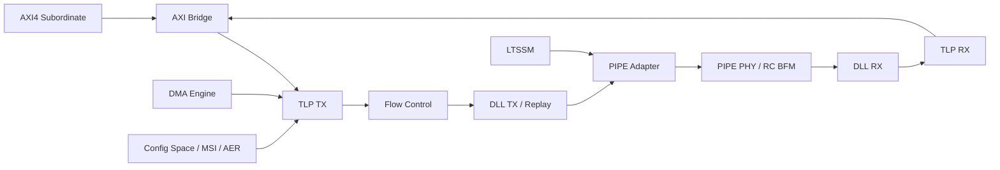

# PCI Express Gen7 Controller Block Diagram

Generated: 2026-05-21

The diagram is a delivery-level block view, not a gate-level schematic. Use it to orient reviews and documentation; use the RTL files for exact connectivity.
